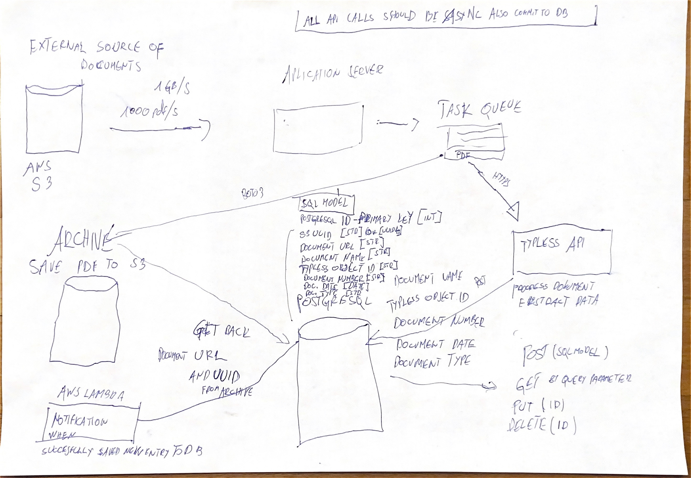

# TYPLES DOCS
#### System that extracts and save information from documents

This project uses `UV` as Python package and project manager, written in Rust: https://docs.astral.sh/uv/

On macOS install with homebrew:
```bash
brew install uv
```

## Running the project

### Running server in dev mode to reload on changes

```bash
uv run uvicorn src.server:app --reload
```
## Run database
To run the database, you need to have Docker installed on your machine. Once you have Docker installed, you can run the following command from the root directory of the project:

```bash
Run from root:
```bash
docker compose up
```

## API documentation

The API documentation (Swagger UI) is available at:
http://localhost:8000/docs

## How processing in this project works

- PDF documents are stored in S3 bucket. This bucket act like an external source. You can get all documents names sored in bucket in this api: `/s3/documents/all`
- The same documents are also stored locally in the `data/inciuces` folder (this is used for testing/mocking).
- For processing and saving the documents, we use the `/process-and-save-document/` endpoint. There are predefined parameters for this endpoint:file, document_type_name, s3_uuid, document_url.
- To process other documents that you get from the `/s3/documents/all` endpoint, you need to set file query parameter in `/process-and-save-document/` endpoint to the path of the document you want to process. like this: `file=data/invoices/{invoice you get}.pdf)`.
- Document type name is just one `"demo-invoice"` and is hardcoded in code. Mocking all documents with this document type.
- After processing, the documents are stored in the database.
- You can edit, delete or get the documents (with search query parameters) available through api endpoints via swagger UI: http://localhost:8000/docs

## Requirements for running the project (answering the questions from technical assignment)

The System should have approximately one gigabyte/s bandwidth and 2,592,000 gigabytes (2.6 petabytes or 2.6 million gigabytes) of storage for period one month.

## Formatting

For formating we use `black` and `isort`.

To use black and isort, you need to install them first. You can do this by running the following command:

```bash
uv add black isort
```
Then, you can format your code by running the following command:

```bash
source .venv/bin/activate
black .
isort .
```

### PDF invoices Dataset source
I got invoices PDFs that I want to process with Typless here on [kaggle](https://www.kaggle.com/datasets/ayoubcherguelaine/company-documents-dataset)

### Typless API

I trained new document type on [Typless app](https://app.typless.com/). Than use this document type named `demo-invoice` to process documents.

### Arhitecture

